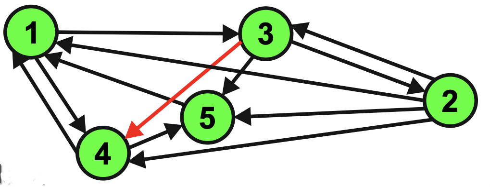
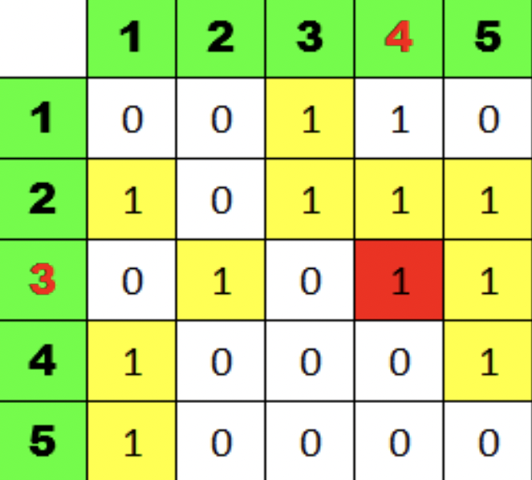
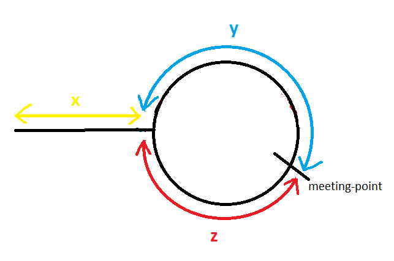

# Task definition

Question: Write a Python function that can detect whether an arbitrary graph has cycles or not.

Submission:
1. Correct and efficient implementation.
2. How do you test your implementation and convince yourself it is correct?
3. Documentation - readme - pros & cons, potential improvement.


## Introduction

Algorithmic complexity can be defined with the big-0 notation (N size problem), therefore the most efficient complexity operation is O(1). 

A graph consists of nodes and edges connecting them together. 



This assumes that every graph can be represented by a matrix sequentially indexed from 0 to N-1, where N defines edges number of the graph.
Every cell of the matrix represents only one possible connection between edges.




Example: 
 [(1,3) , (1,4) , (2,1) , (2,3) , (2,4) , (2,5) , (3,2) , **(3,4)** , (3,5) , (4,1) , (4,5) , (5,1)]


## Algorithm proposal - memory efficient solution

Adjacency list seems to be one of the best usecases because of the memory efficiency. (It doesn't include unused memory cells - except isolated edges)

1. Determine whether the array never have a cycle.
2. Initialize 2 pointers (slower goes by one node and faster by two nodes).
3. Start iterating through the array:
   
   a) There is no cycle in the array - in this scenario both pointers reach False.

   b) There is a cycle in the array - it means that both pointers match at one node.
4. Unlucky me, because Python doesn't support pointers, so I focus on finding duplicates (=True). In this case I iterate through the array and search for the distance suggesting that loop exists.
   
## Proof



Distance travelled by slowPointer before meeting is equal to:

 <p align="center"> 𝑥 + 𝑦 </p>

Distance travelled by fastPointer before meeting:

<p align="center"> (𝑥 + 𝑦 + 𝑧) + 𝑦 = 𝑥 + 2 𝑦 + 𝑧 </p>


Since fastPointer travels with double the speed of slowPointer, and time is constant for both when both pointers reach the meeting point. So by using simple speed, time and distance relation (slowPointer traveled half the distance):

<p align="center"> 2∗dist(slowPointer) 2(𝑥+𝑦)2𝑥 + 2𝑦𝑥 = dist(fastPointer) = 𝑥 + 2𝑦 + 𝑧 = 𝑥+ 2𝑦 + 𝑧 = 𝑧 </p>

Hence by moving slowPointer to start of linked list, and making both slowPointer and fastPointer to move one node at a time, they both have same distance to cover.

[**reference** of this example](https://cs.stackexchange.com/questions/10360/floyds-cycle-detection-algorithm-determining-the-starting-point-of-cycle)

## Tests 

In order to proof that my code implementation works, I decided to create some array example as mentioned above:

```python

    example = np.array(
        [
            [0, 0, 1, 1, 0],
            [1, 0, 1, 1, 1],
            [0, 1, 0, 1, 1],
            [1, 0, 0, 0, 1],
            [1, 0, 0, 0, 0],
        ]
    )
# output:
# (True, 'Cycle found, total bytes consumed by the elements of the array:', 200)
```


## Adjacency Lists

### Pros of Adjacency List

- An adjacency list is efficient in terms of storage because we only need to store the values for the edges. For a sparse graph with millions of vertices and edges, this can mean a lot of saved space.
- It also helps to find all the vertices adjacent to a vertex easily.

### Cons of Adjacency List
- Finding the adjacent list is not quicker than the adjacency matrix because all the connected nodes must be first explored to find them.
